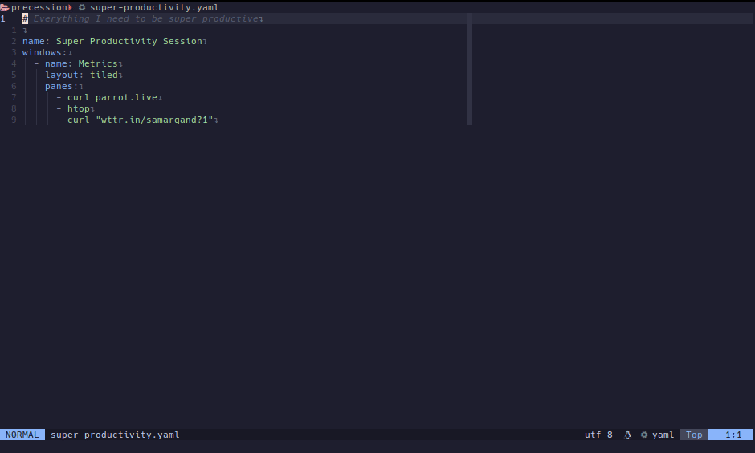

# Precession
A simple tmux session manager



Define arbitrarily complex tmux sessions in a declarative way, using yaml, and 
spin them up with a simple command.

## Format
Precession follows a dead-simple format for defining sessions. It follows the 
tmux naming scheme of "sessions", "windows" and "panes". Here's a quick example

```yaml
# Sessions are defined at the top level
name: My web project
root: ~/projects/my_web_project

# Windows are defined under the `windows` key
windows: 
  - name: Code
    cmd: vim .                             # Simple windows can define an optional `cmd` to run
    
  - name: Dev servers
    layout: even-horizontal
    panes:                                 # More complex windows can define a set of panes
      - docker-compose up
      - cd server && cargo run
      - cd client && yarn start
      
  - name: Tests
    layout: even-horizontal
    panes:
      - cd server && cargo watch -x test
      - cd client && yarn test --watch
      -                                    # "An empty" pane just drops you into a shell
```

## FAQ
### Why not just write a bash script?
...because I _really_ don't want to. Setting up these sessions happens rarely
enough that I'd have to read through the man pages every time to brush up on 
tmux's syntax. I know yaml, and it takes a whole of 10 seconds to grok
Precession's format. But hey, you do you.

### Why another tmux session manager?
It's not like people haven't thought of this before. The popular option, by far,
is [tmuxinator](https://github.com/tmuxinator/tmuxinator). I've used it before,
with little issue, and it's great. It just rubs me the wrong way that to use it,
I need to install a whole bunch of Ruby dependencies. A simple utility forcing
me to install a bunch of extra cruft into my system's global namespace is not
something I can get behind.


# TODO
- [✓] Support panes
- [✓] Support layouts
- [✓] Have Serde infer defaults, rather than having conditionals littered
      throughout.
- [ ] Do some amount of validation? A window can't have both a `cmd` _and_ a
      `panes` field.
- [ ] Check if a session already exists, and attach if so
- [ ] Figure out why tmux server is crashing on exit
